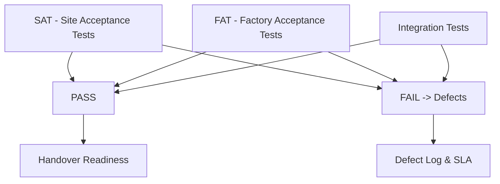

# Commissioning Matrix

```mermaid
graph TD
SAT[SAT - Site Acceptance Tests] --> PASS[PASS]
SAT --> FAIL[FAIL -> Defects]
FAT[FAT - Factory Acceptance Tests] --> PASS
FAT --> FAIL
INT[Integration Tests] --> PASS
INT --> FAIL
FAIL --> DefectLog[Defect Log & SLA]
PASS --> Handover[Handover Readiness]
```
