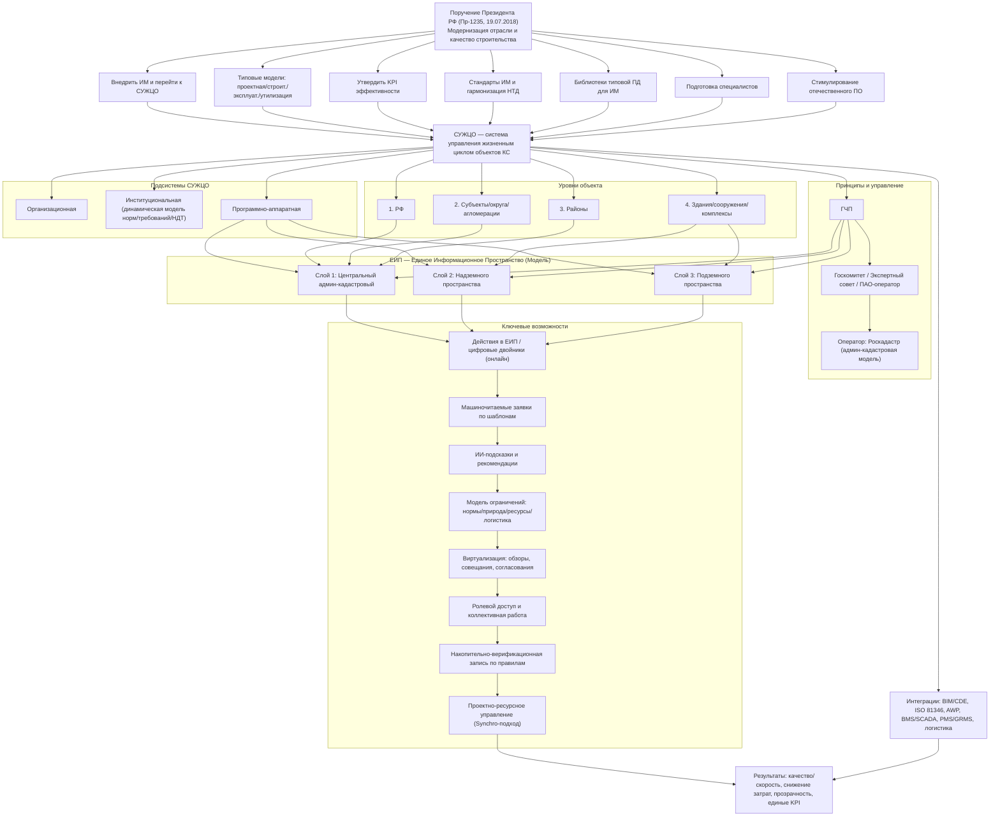

# Схема СУЖЦО

```mermaid
graph TD
PR["Поручение Президента РФ (Пр-1235, 19.07.2018)<br/>Модернизация отрасли и качество строительства"]

T1["Внедрить ИМ и перейти к СУЖЦО"]
T2["Типовые модели: проектная/строит./эксплуат./утилизация"]
T3["Утвердить KPI эффективности"]
T4["Стандарты ИМ и гармонизация НТД"]
T5["Библиотеки типовой ПД для ИМ"]
T6["Подготовка специалистов"]
T7["Стимулирование отечественного ПО"]

PR --> T1
PR --> T2
PR --> T3
PR --> T4
PR --> T5
PR --> T6
PR --> T7

SU["СУЖЦО — система управления жизненным циклом объектов КС"]
T1 --> SU
T2 --> SU
T3 --> SU
T4 --> SU
T5 --> SU
T6 --> SU
T7 --> SU

subgraph "Уровни объекта"
L1["1. РФ"]
L2["2. Субъекты/округа/агломерации"]
L3["3. Районы"]
L4["4. Здания/сооружения/комплексы"]
end

subgraph "Принципы и управление"
PPP["ГЧП"]
GOV["Госкомитет / Экспертный совет / ПАО-оператор"]
OP["Оператор: Роскадастр (админ‑кадастровая модель)"]
end

subgraph "Подсистемы СУЖЦО"
ORG["Организационная"]
INS["Институциональная (динамическая модель норм/требований/НДТ)"]
PA["Программно-аппаратная"]
end

subgraph "ЕИП — Единое Информационное Пространство (Модель)"
E1["Слой 1: Центральный админ‑кадастровый"]
E2["Слой 2: Надземного пространства"]
E3["Слой 3: Подземного пространства"]
end

subgraph "Ключевые возможности"
C1["Действия в ЕИП / цифровые двойники (онлайн)"]
C2["Машиночитаемые заявки по шаблонам"]
C3["ИИ‑подсказки и рекомендации"]
C4["Модель ограничений: нормы/природа/ресурсы/логистика"]
C5["Виртуализация: обзоры, совещания, согласования"]
C6["Ролевой доступ и коллективная работа"]
C7["Накопительно‑верификационная запись по правилам"]
C8["Проектно‑ресурсное управление (Synchro‑подход)"]
end

INT["Интеграции: BIM/CDE, ISO 81346, AWP, BMS/SCADA, PMS/GRMS, логистика"]
RES["Результаты: качество/скорость, снижение затрат, прозрачность, единые KPI"]

SU --> L1
SU --> L2
SU --> L3
SU --> L4
SU --> PPP
SU --> ORG
SU --> INS
SU --> PA
PPP --> GOV
GOV --> OP
PPP --> E1
PPP --> E2
PPP --> E3
PA --> E1
PA --> E2
PA --> E3
L1 --> E1
L2 --> E1
L3 --> E1
L4 --> E2
L4 --> E3
E1 --> C1
E2 --> C1
E3 --> C1
C1 --> C2
C2 --> C3
C3 --> C4
C4 --> C5
C5 --> C6
C6 --> C7
C7 --> C8
C8 --> RES
SU --> INT
INT --> RES
```
